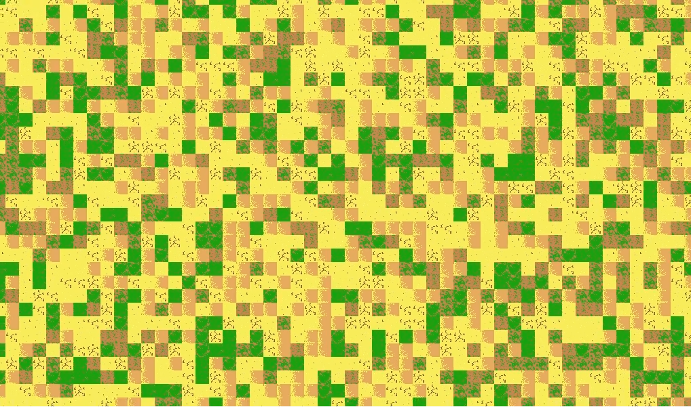
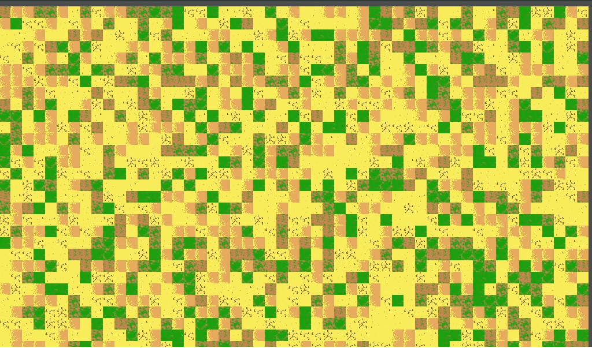
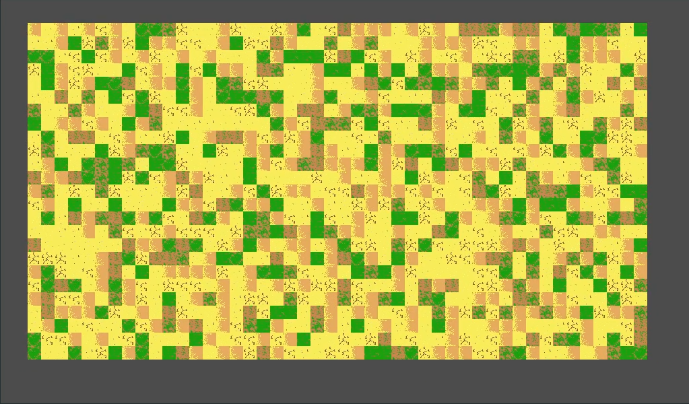

# Godot-FOV-Tilemaps

Simple script for Godot 3.0+ that shows any tilemap like normal but clears all cells outside of the Camera2D's FOV.

It works by only setting cells of the map that are visible to the Camera2D node that you handed over to the functions. It's a side-project of mine and just a nice little experiment. Note that Godot itself takes care of the tile map rendering, but with much better performance (see "clipping"; also this script is "only" GDScript).

This allows you to work, for example, together with a procedural map generator. You can add your generated cells to the map dictionary and activate the garbage collection, so that you only have to generate around the camera fov, but with a buffer of an arbitrary number of cells. There are functions to add, remove and update any cell, garbage collecting cells and getting some stats like the start/end point.

You could also use this to have a very crude visual range effect if you set the `CellMargin` to a negative value, which makes the visible map smaller than the Camera FOV. More below at "Media".

Note that this script has, of course, a clear performance loss, which also depends greatly on the Camera zoom, the Viewport size and the cell quadrant size; more info about this below at "Comparison".
So if you want to use this in your production game, check this list first:

1. Seriously consider if this is a good idea.
2. If yes, re-write this in GDNative, this will make it much faster.
3. Dismiss the idea anyways.

The map dictionary is constructed like so:

```python
Dictionary map = {
    int x0 : { int y0 : int TileID, int y1 : int TileID, ... },
    int x1 : { int y0 : int TileID, int y1 : int TileID, ... },
    int x2 : { int y0 : int TileID, int y1 : int TileID, ... },
    ...
}
```

The only file you will need to get started is this one: [fov_tilemap.gd](fov_tilemap.gd)

---

## Usage

Before you can actually use this, you have to have a tilemap and a Camera2D. After you set the tilemap and camera to your needs, import the script and run the following command to load the map for it:

```python
load_map(MapNode)
```
... where `MapNode` is your Tilemap Node.

Then you can call the following whenever you want to update the map (preferably whenever the Camera2D has moved or in `_process`).

```python
draw_map(MapNode, CameraNode, CellMargin=0)
```
...where `MapNode` is your Tilemap Node, `CameraNode` is your moving Camera2D Node and `CellMargin` is the margin of cells around your FOV (e.g. 1 is one more cell and -1 is one cell less on each side of the Camera FOV; default: 0)

You can also get the start and ending points of your map using these two functions:

```python
get_start_point()
get_end_point()
```
... which both return a Vector2 with the coordinates. However, if you already loaded the map, you can simply grab the vars that the map loader has created.

```python
var start_point
var end_point
```

**More functions to come!**

---

## Example

Conveniently, this repository is also a Godot testing project. By downloading this repo and importing it in Godot 3.0+ you can instantly see and learn how this would be used and how the script works.

---

## Media

This is what it looks like if you set `CellMargin` to `1`:



No real difference, right? :)

This is what it looks like if you do not set any `CellMargin` (aka `0`):



Note that this screenshot has been taken while moving, when the camera doesn't move you don't see any difference as well.

And finally, this is what it looks like if you use a negative (e.g. `-3`) `CellMargin`:



---

## Comparison

These are my first simple performance test results all tested on the same medium-weak Linux laptop with dedicated graphics.

**Environment: Tilemap 100x100 cells, 13 different tiles (20x20), Camera Scrolling Speed 200px/frame, script in _process, else standard settings.**

**You can test it yourself, see "Example".**

|Camera Zoom: | 0.5 |	1.0 | 1.5 | 2.0 | Max RAM usage |
| --- | --- | --- | --- | --- | --- |
|FPS normal: | 182 | 172 | 153 | 145 | 35 MB |
|FPS with this script: | 194 | 172 | 124 | 86 | 36 MB |

**Same Env as above, but this time with a Tilemap size 1000x1000:**

|Camera Zoom: | 0.5 |	1.0 | 1.5 | 2.0 | Max RAM usage |
| --- | --- | --- | --- | --- | --- |
|FPS normal: | 181 | 177 | 159 | 137 | 326 MB |
|FPS with this script: | 204 | 173 | 124 | 85 | 358 MB |
